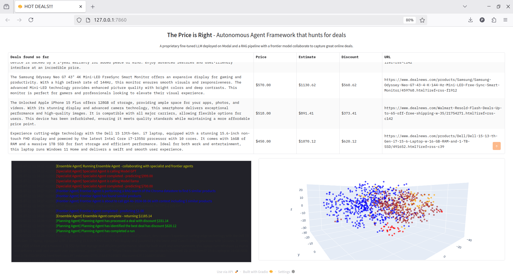

# Agentic Price Prediction Framework

This project delivers a modular, agent-based system for automated product price estimation and deal discovery within the e-commerce space. Leveraging large language models (LLMs), including both GPT and fine-tuned open-source models, classical machine learning and state-of-the-art retrieval and embedding technologies, the framework enables robust and explainable price predictions on product listings. Visual dashboards and real-time interactions are powered through Gradio/Plotly. On the other hand, data management utilizes Chroma and scalable cloud platforms such as Modal.

## Features & Capabilities

- **End-to-End Price Prediction Pipeline:** Supports traditional ML (Random Forests), zero/fine-tuned LLMs, and ensemble methods for benchmarking.
- **Agentic Framework:** Modular agents automate scanning for deals, retrieval-augmented inference, specialized price reasoning, ensembling, and planning.
- **Retrieval-Augmented Generation:** Uses a vector database (Chroma) for context-aware predictions, grounding LLM in similar real-world examples.
- **Interactive Visualization:** Real-time interface for displaying deal analysis, price comparisons and logs with Gradio and Plotly.
- **Fine-Tuning Open- and Closed-Source LLMs:** Supports QLoRA-based efficient tuning (Meta LLaMA), OpenAI GPT-4/4o, and robust inference APIs.
- **Data Engineering & Preprocessing Pipelines:** Parallel dataset curation, filtering, tokenization, and prompt-generation from large retail datasets.
- **Extensible Design:** Easily add new categories, agents, or model types for further research or production deployment.

## Installation

### Prerequisites


- Python 3.10+ recommended
- **Virtual environment:** All required packages are already installed and stored in the `llms` directory inside the project root.
- (Optional) CUDA-enabled GPU for efficient model training/inference
- Access to relevant API keys (OpenAI, HuggingFace, Modal)

### Setup Instructions

1. Clone this repository
```
git clone https://github.com/HienNguyen2311/deals_agents
cd deals_agents
```
2. Activate the provided virtual environment:
* For Unix/macOS: ```source llms/bin/activate```
* For Windows (Command Prompt): ```llms\Scripts\activate```

3. Set up environment variables:

Fill in your API keys in your `.env` file.

<p>OPENAI_API_KEY=</p>
<p>HF_TOKEN=</p>
<p>WANDB_API_KEY=</p>

4. Additional Setup:

* For LLM fine-tuning: Ensure CUDA, PyTorch, and other dependencies are compatible with your environment.
* Make sure [Modal.com](https://modal.com/) API access is configured for remote agent inference, such as add in openai-secret and hf-secret on Modal.
* Check that [ChromaDB](https://www.trychroma.com/) is installed and the correct path is set for persistent vectorstore.
* Once the `llms` virtual environment is activated, you can proceed to run the application as described in the Usage section.

## Usage

### Program Descriptions

* ```data_preprocessed.ipynb```: This notebook loads and filters multiple retail product datasets from Hugging Face (e.g., Appliances, Electronics), analyzes missing values, and outputs cleaned .pkl files containing structured training/test data with prices for use across the pipeline.
* ```price_prediction.ipynb```: It trains and benchmarks various pricing models, including Random Forests, Word2Vec embeddings, and fine-tuned language models. The file produces metrics visualizations and serialized fine-tuned models for comparison.
* ```agents_demo.ipynb```: This notebook demonstrates the construction, embedding-based retrieval, and operation of agentic modules (e.g. Scanner, Specialist, Ensemble agents), and visualizes their reasoning using Plotly charts and t-SNE representations. The t-SNE plot visualizes the high-dimensional product embedding vectors from four retail categories (Appliances, Electronics, Toys and Games, and Musical Instruments) by projecting them into a two-dimensional space.
* ```run_agentic.py```: The script launches the full deal prediction agent framework and a Gradio interface, producing a real-time dashboard with visualization plots, agent logs, and ranked pricing predictions based on multi-agent collaboration.

### Sample Workflow

1. **ScannerAgent** collects new deals from feeds.
2. **SpecialistAgent** and **FrontierAgent** estimate prices via LLMs and RAG context.
3. **EnsembleAgent** aggregates predictions for accuracy.
4. **PlanningAgent** surfaces top opportunities and visual results.

## Data Sources

* Amazon Reviews 2023 Dataset: Sourced from HuggingFace (McAuley-Lab/Amazon-Reviews-2023), covering product metadata and reviews across diverse categories.
* Curated subsets: Processed to focus on electronics, appliances, toys, and other consumer goods.
* Full details, EDA, and preprocessing steps are documented in the notebooks and the project report.

## Technologies & Libraries

* Large Language Models: OpenAI GPT-4o, Meta LLaMA-3.1 (+ fine-tuned variants with QLoRA/LoRA)
* Machine Learning: scikit-learn, Gensim (for Word2Vec embedding), sentence-transformers
* Data Management: Pandas, Numpy, HuggingFace Datasets, ChromaDB (vectorstore)
* Cloud Inference/Fine-tuning: Modal.com, HuggingFace Hub, Weights & Biases
* Visualization/UI: Gradio, Plotly, matplotlib, tqdm
* Utilities: dotenv, joblib, logging, Python threading

## Project Report

The Project Report presents a synthesis of the project's methodology, experimental setup, and results. Key findings include:

1. Fine-Tuning Improves Model Specialization for Price Prediction

* Fine-tuning Meta's LLaMA-3.1 using QLoRA led to a substantial performance improvement, reducing Mean Absolute Error (MAE) from 95.49 to 24.99, nearly matching the performance of much larger proprietary models like GPT-4o

* OpenAI’s GPT-4o, while strong in zero-shot performance (MAE: 23.21), did not benefit significantly from additional fine-tuning, likely due to task redundancy or risk of overfitting a pre-trained generalist model

2. Retrieval-Augmented Generation Boosts Accuracy

* The Frontier Agent, which implements retrieval-augmented generation (RAG) by grounding predictions in similar historical product examples, achieved the lowest MAE (20.08) among all tested models and agents.

* The result highlights the efficacy of integrating LLMs with a vector database (Chroma) for contextually-enhanced reasoning and improved numeric inference.

3. Ensembling Delivers Robust and Balanced Performance

* The Ensemble Agent, combining outputs from fine-tuned GPT and LLaMA models along with the Frontier Agent, offered the best RMSLE score (0.43), indicating stable relative-price accuracy even when absolute estimates slightly varied

* Linear regression-based aggregation led to resilient price predictions by mitigating individual model bias and harnessing model diversity.

4. Lightweight, Efficient Fine-Tuning with QLoRA

* QLoRA provided a highly compute-efficient method for tuning LLaMA models without requiring full retraining or high-end GPU resources, demonstrating its viability for applied NLP in constrained environments

* It preserved task adaptability while maintaining inference efficiency and compatibility with quantized model formats.

5. Live System Demonstrates Real-Time Human-AI Interaction

* The system’s user interface presents dynamic logs, predictions, and visual deal summaries, showcasing how LLM-driven reasoning can be surfaced transparently for real-time decision-making

It should be noted that this project was largely adapted from "LLM En-
gineering - Master AI and LLMs" repository by Edward Donner. The automated data pipeline, visualizations, and model evaluation methodologies were primarily based on examples and approaches presented in this repository.

## Screenshots


User interface with Gradio